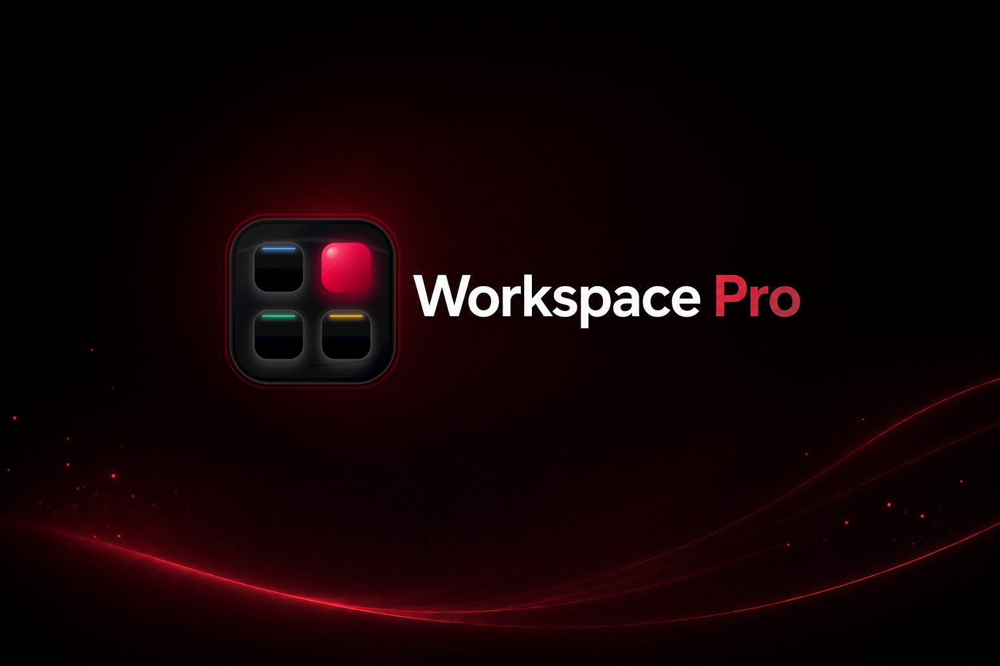
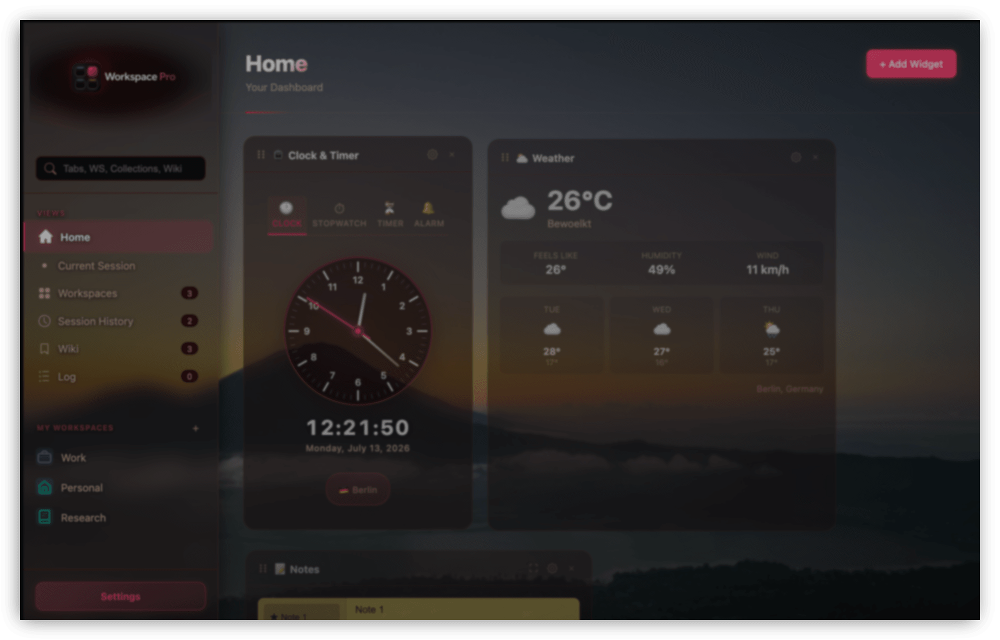
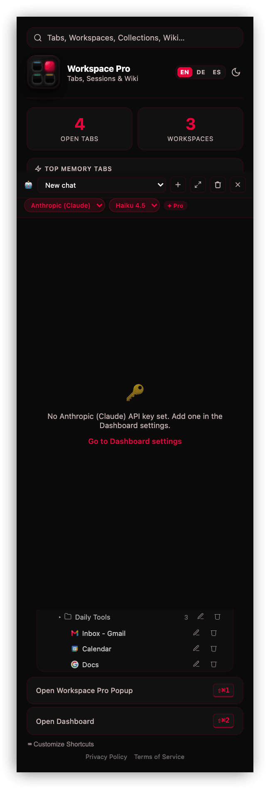
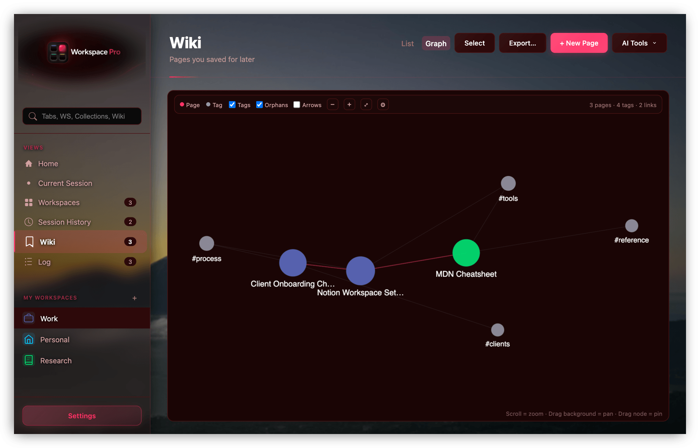
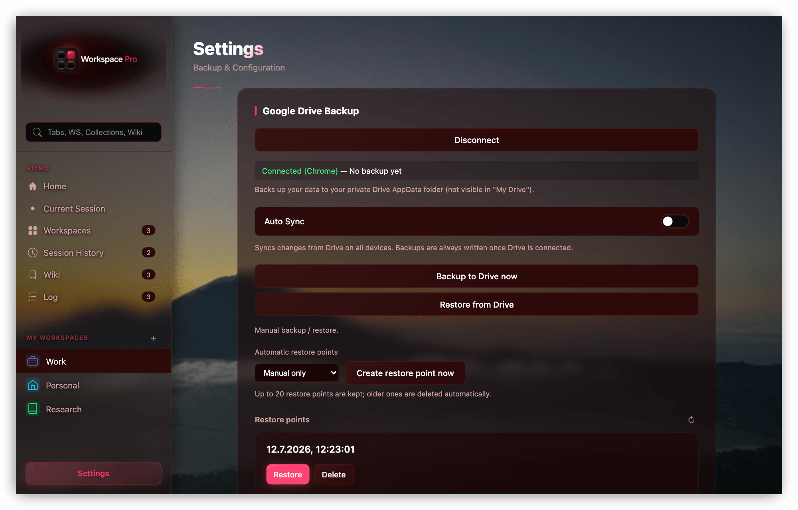

**Your Browser. Your Rules.**

Tab & session management for power users — built for developers, homelab enthusiasts, and IT professionals.

[Website](https://workspace-pro.app) · [Documentation](https://workspace-pro.app/docs) · [Chrome Web Store](https://chrome.google.com/webstore/detail/jplhkjcdmpchejmdjjdckpbhdognoknm) · [Report a Bug](https://github.com/Br3akTheBr33d/Workspace-Pro-Offical/issues/new?template=bug_report.yml) · [Request a Feature](https://github.com/Br3akTheBr33d/Workspace-Pro-Offical/issues/new?template=feature_request.yml)

---

## Workspace Pro v1.0.8 — Live on the Chrome Web Store

Workspace Pro turns every new tab into a local-first command center for your browser. Organize tabs into workspaces and collections, restore saved sessions, and use an optional Pro dashboard for AI tools, widgets, and private Google Drive backup.

> Built for power users who live in the browser. Works on Chrome, Brave, Edge, and other Chromium-based browsers.

---

## Features in v1.0.8

### Free

| Feature | What it does |
|---|---|
| **Workspaces & Collections** | Organize projects, clients, and contexts; save tabs with notes and sticky notes. |
| **Session History** | Keep up to 50 saved browser sessions and restore them when needed. |
| **Current Session** | Search and manage your currently open tabs. |
| **Personalization** | Eight dark-first themes, custom colors, and English, German, or Spanish UI. |
| **Local-first data** | Workspace data remains on your device by default. |

### Pro

| Feature | What it does |
|---|---|
| **Unlimited organization** | Remove free-tier workspace and collection limits. |
| **AI tab tools** | Group tabs by category, domain, or your AI provider and summarize open tabs. |
| **Workspace Pro Assistant** | Chat with your own provider key, use Haiku or Sonnet models, attach files, and work with contextual browser tools. |
| **Dashboard widgets** | Add, resize, and arrange Clock & Timer, Weather, News, Notepad, Assistant, Countdown, and Quick Links widgets. |
| **Tab Resource Monitor** | Find memory-heavy tabs quickly. |
| **Google Drive Backup** | Store opt-in backups in a private Drive AppData folder. |

---

## Dashboard widgets

| Widget | Highlights |
|---|---|
| **Clock & Timer** | World clocks, stopwatch, timer, and alarms. |
| **Weather** | Five-day forecast from Open-Meteo; no API key required. |
| **News** | RSS-based tech and AI news with topic filters. |
| **Notepad** | Multi-page rich text notes with headings and lists. |
| **Workspace Pro Assistant** | Persistent AI chat using your provider key. |
| **Countdown** | Recurring deadlines with Chrome notifications. |
| **Quick Links** | Pinned shortcuts with favicons and emoji. |

---

## Keyboard shortcuts

| Action | Windows / Linux | Mac |
|---|---|---|
| Open Popup | `Ctrl + Shift + 1` | `⌘ + Shift + 1` |
| Open Dashboard | `Ctrl + Shift + 2` | `⌘ + Shift + 2` |
| Open Workspace Pro Assistant | `Ctrl + Shift + 9` | `⌘ + Shift + 9` |
| Close any modal | `Esc` | `Esc` |
| Save a form | `Enter` | `Enter` |
| Save a note | `Ctrl + Enter` | `⌘ + Enter` |

Default shortcuts can be changed in `chrome://extensions/shortcuts`.

---

## Privacy and backup

Workspace Pro has no analytics, tracking, or advertising. Optional AI actions send only the tab or chat content needed for the action you explicitly start. Optional Google Drive backup uses the private AppData folder, and license validation uses a pseudonymous device token rather than workspace data.

[Privacy Policy](https://workspace-pro.app/privacy-policy) · [Terms of Service](https://workspace-pro.app/terms)

---

## Coming in v1.1.0

> **Preview only:** v1.1.0 is in development and is **not part of the published v1.0.8 Chrome Web Store release**. Screens and wording may change before release.

The upcoming Pro Wiki turns clipped pages into a local searchable knowledge base. It includes full-text search, tags, `[[wikilinks]]`, backlinks, a visual graph, Markdown export, and optional AI Compile, Lint, and Ask Wiki workflows using your own provider key. The update also expands Assistant coverage, improves the popup experience, and adds versioned Drive restore points.

[Read the v1.1.0 preview in the documentation →](https://workspace-pro.app/docs#doc-wiki)

---

## Pricing

**Start free. Upgrade when you need more.**

| | Free | Pro |
|---|---|---|
| **Price** | €0 | One-time license key |
| **Workspaces** | 1 | Unlimited |
| **Collections** | 1 per workspace | Unlimited |
| **Session History** | Up to 50 saves | Up to 50 saves |
| **Themes & languages** | All themes; EN / DE / ES | All themes; EN / DE / ES |
| **Widgets, AI & Drive backup** | — | Included |

[Get Pro License →](https://workspace-pro.app/#pricing)

---

## Bug reports and feature requests

This repository is the public issue tracker for Workspace Pro.

- **Found a bug?** → [Open a Bug Report](https://github.com/Br3akTheBr33d/Workspace-Pro-Offical/issues/new?template=bug_report.yml)
- **Have an idea?** → [Request a Feature](https://github.com/Br3akTheBr33d/Workspace-Pro-Offical/issues/new?template=feature_request.yml)
- **Need help?** → [Contact support](https://workspace-pro.app/contact) or email [support@workspace-pro.app](mailto:support@workspace-pro.app)

---

© 2026 Workspace Pro · [workspace-pro.app](https://workspace-pro.app)

*Not affiliated with Google, Brave Software, or Microsoft.*

