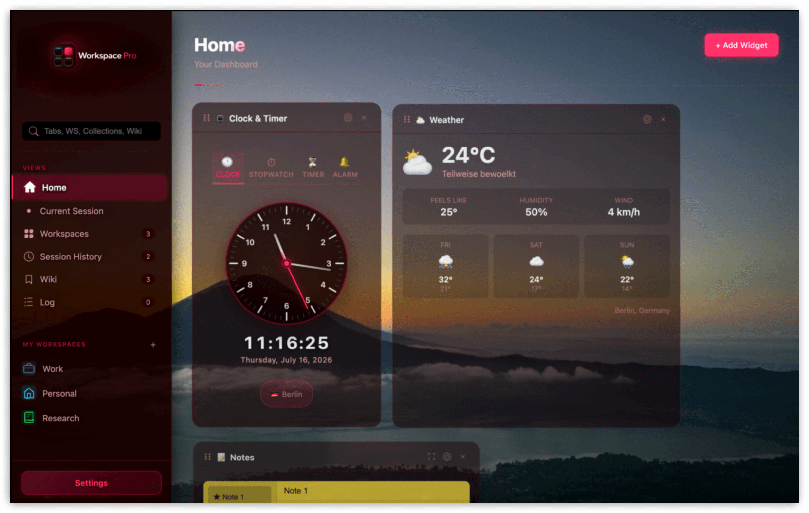
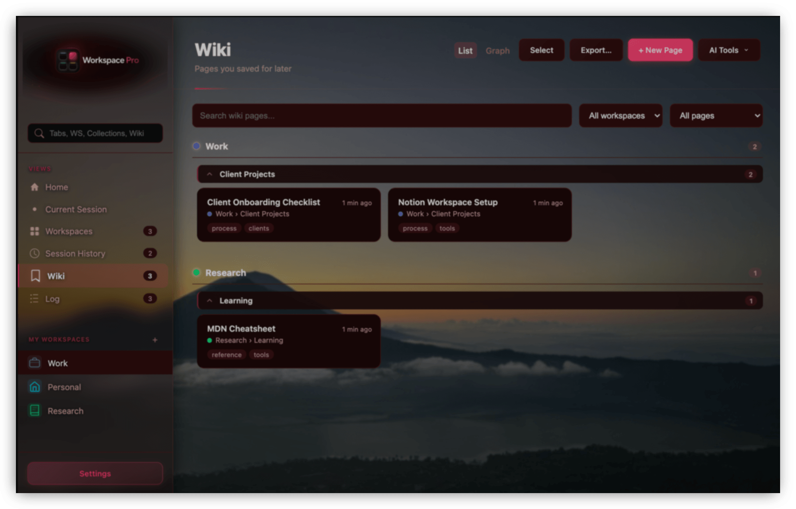
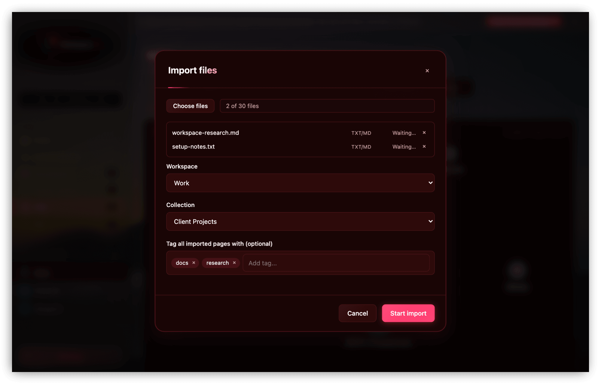
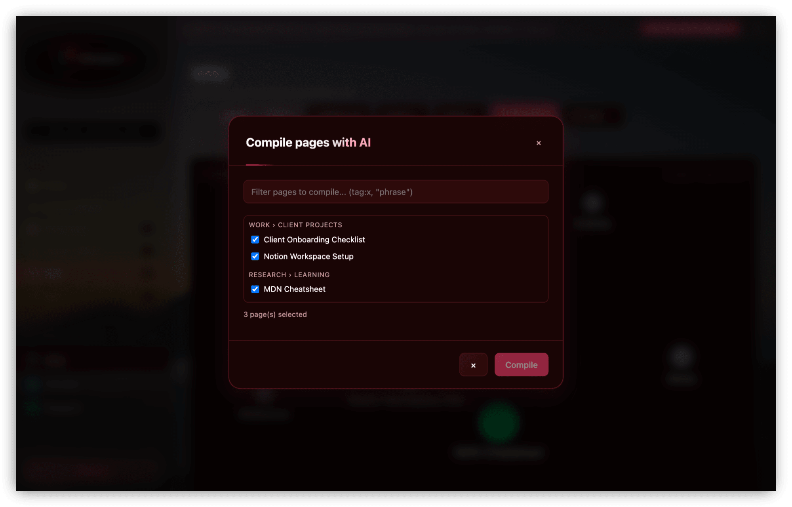

**Your Browser. Your Rules.**

Tab & session management for power users — built for developers, homelab enthusiasts, and IT professionals.

[Website](https://workspace-pro.app) · [Documentation](https://workspace-pro.app/docs) · [Chrome Web Store](https://chrome.google.com/webstore/detail/jplhkjcdmpchejmdjjdckpbhdognoknm) · [Report a Bug](https://github.com/Br3akTheBr33d/Workspace-Pro-Offical/issues/new?template=bug_report.yml) · [Request a Feature](https://github.com/Br3akTheBr33d/Workspace-Pro-Offical/issues/new?template=feature_request.yml)

---

## Workspace Pro v1.1.0 — Live on the Chrome Web Store

Workspace Pro turns every new tab into a local-first command center for your browser. Organize tabs into workspaces and collections, restore saved sessions, keep a personal searchable Wiki of clipped pages, and use an optional Pro dashboard for multi-provider AI tools, widgets, and private Google Drive backup.

> Built for power users who live in the browser. Works on Chrome, Brave, Edge, and other Chromium-based browsers.

---

## Features in v1.1.0

### Free

| Feature | What it does |
|---|---|
| **Workspaces & Collections** | Organize projects, clients, and contexts; save tabs with notes and sticky notes. |
| **Session History** | Keep up to 50 saved browser sessions and restore them when needed. |
| **Current Session** | Search and manage your currently open tabs. |
| **Personalization** | Eight dark-first themes, custom colors, and English, German, or Spanish UI. |
| **Local-first data** | Workspace data remains on your device by default. |

### Pro

| Feature | What it does |
|---|---|
| **Unlimited organization** | Remove free-tier workspace and collection limits. |
| **Personal Wiki** | Clip pages into a local, full-text-searchable knowledge base with tags, `[[wikilinks]]`, backlinks, and a visual graph. |
| **AI tab tools** | Group tabs by category, domain, or your AI provider and summarize open tabs. |
| **Workspace Pro Assistant** | Chat with your own Claude, OpenAI, or OpenRouter key, browse live model lists, attach files, and act on contextual browser and Wiki tools. |
| **Dashboard widgets** | Add, resize, and arrange Clock & Timer, Weather, News, Notepad, Assistant, Countdown, and Quick Links widgets. |
| **Tab Resource Monitor** | Find memory-heavy tabs quickly. |
| **Google Drive Backup** | Opt-in backups plus versioned, timestamped restore points in a private Drive AppData folder. |

---

## Personal Wiki

Clip any page from the dashboard or popup and it becomes a local Wiki page — Markdown content, editable metadata, tags, and notes, all stored on your device. Full-text search supports operators like `tag:`, `title:`, and `-exclude`, pages link to each other with `[[wikilinks]]`, and a visual graph shows how everything connects.

Bring in existing notes with **bulk import** (Markdown, text, Word, Excel, and images) in one batch, or export any page — or the whole Wiki — as Obsidian-compatible Markdown.

Everything above is local and works without AI. If you add your own provider key, optional **Compile**, **Lint**, and **Ask Wiki** workflows can synthesize new pages, flag orphaned or broken links, and answer questions grounded only in your own Wiki content — every AI call is opt-in, requires explicit consent, and is logged in an activity log you can review.

[Read the full Wiki guide in the documentation →](https://workspace-pro.app/docs#doc-wiki)

---

## Dashboard widgets

| Widget | Highlights |
|---|---|
| **Clock & Timer** | World clocks, stopwatch, timer, and alarms. |
| **Weather** | Five-day forecast from Open-Meteo; no API key required. |
| **News** | RSS-based tech and AI news with topic filters. |
| **Notepad** | Multi-page rich text notes with headings and lists. |
| **Workspace Pro Assistant** | Persistent AI chat using your Claude, OpenAI, or OpenRouter key. |
| **Countdown** | Recurring deadlines with Chrome notifications. |
| **Quick Links** | Pinned shortcuts with favicons and emoji. |

---

## Keyboard shortcuts

| Action | Windows / Linux | Mac |
|---|---|---|
| Open Popup | `Ctrl + Shift + 1` | `⌘ + Shift + 1` |
| Open Dashboard | `Ctrl + Shift + 2` | `⌘ + Shift + 2` |
| Open Workspace Pro Assistant | `Ctrl + Shift + 9` | `⌘ + Shift + 9` |
| Close any modal | `Esc` | `Esc` |
| Save a form | `Enter` | `Enter` |
| Save a note | `Ctrl + Enter` | `⌘ + Enter` |

Default shortcuts can be changed in `chrome://extensions/shortcuts`.

---

## Privacy and backup

Workspace Pro has no analytics, tracking, or advertising. The Wiki is stored locally like the rest of your workspace data. Optional AI actions (tab tools, Assistant, or Wiki Compile/Lint/Ask) send only the content needed for the action you explicitly start, to the provider you configured. Optional Google Drive backup writes to the private AppData folder (not visible in "My Drive") and keeps up to 20 timestamped restore points you can roll back to, and license validation uses a pseudonymous device token rather than workspace data.

[Privacy Policy](https://workspace-pro.app/privacy-policy) · [Terms of Service](https://workspace-pro.app/terms)

---

## Pricing

**Start free. Upgrade when you need more.**

| | Free | Pro |
|---|---|---|
| **Price** | €0 | One-time license key |
| **Workspaces** | 1 | Unlimited |
| **Collections** | 1 per workspace | Unlimited |
| **Session History** | Up to 50 saves | Up to 50 saves |
| **Themes & languages** | All themes; EN / DE / ES | All themes; EN / DE / ES |
| **Wiki, widgets, AI & Drive backup** | — | Included |

[Get Pro License →](https://workspace-pro.app/#pricing)

---

## Bug reports and feature requests

This repository is the public issue tracker for Workspace Pro.

- **Found a bug?** → [Open a Bug Report](https://github.com/Br3akTheBr33d/Workspace-Pro-Offical/issues/new?template=bug_report.yml)
- **Have an idea?** → [Request a Feature](https://github.com/Br3akTheBr33d/Workspace-Pro-Offical/issues/new?template=feature_request.yml)
- **Need help?** → [Contact support](https://workspace-pro.app/contact) or email [support@workspace-pro.app](mailto:support@workspace-pro.app)

---

© 2026 Workspace Pro · [workspace-pro.app](https://workspace-pro.app)

*Not affiliated with Google, Brave Software, or Microsoft.*

